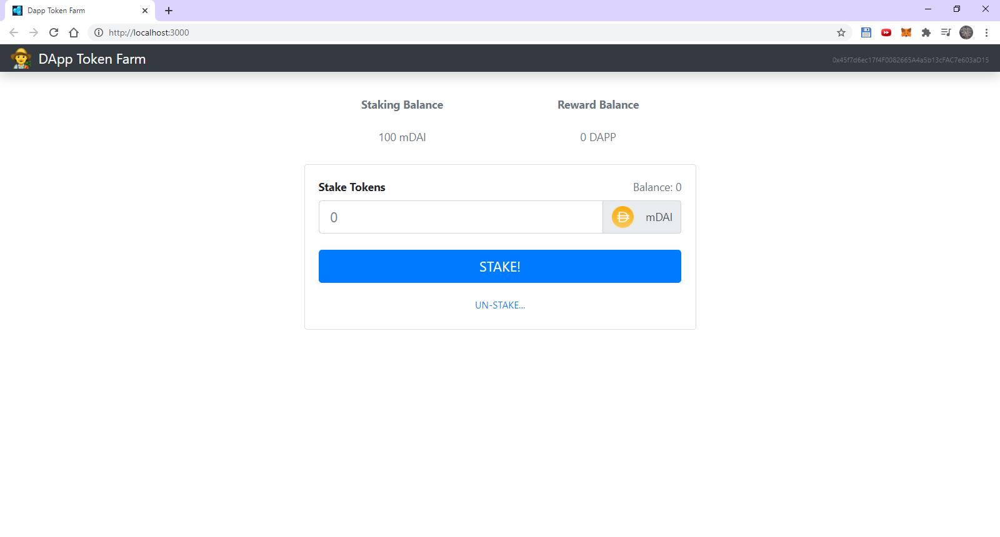
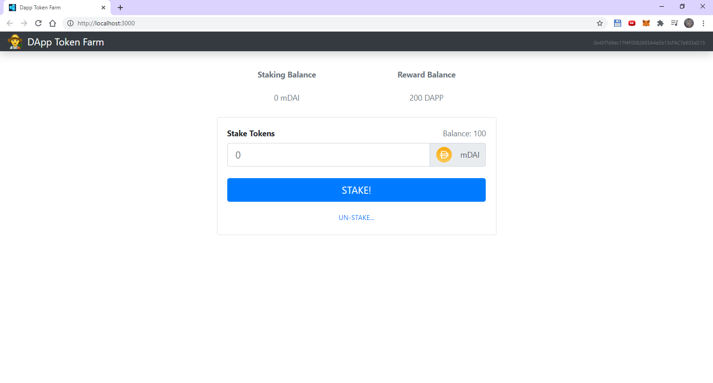

# Preview

## Initial state (haven't staked)

## Staked

## Received reward

## Received reward #2

## Unstaked

# Dependencies
- Ganache
- Truffle
- MetaMask
- npm

# Credit

[Blockchain Tutorial for Beginners | Build a DeFi App (Ethereum, Solidity, Web3.js & Truffle)](https://www.youtube.com/watch?v=CgXQC4dbGUE)
